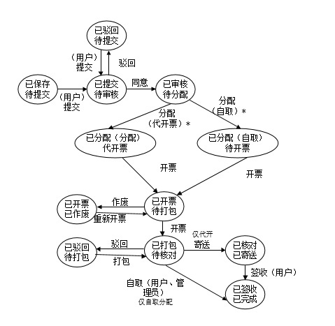

# 前端和后端API接口的说明

##1. 标记说明
 
 ### 1.1 接口权限的标记
 
 【S】表示该接口超级管理员可用

 【A】表示该接口管理员可使用
 
 【C】表示该接口客户可使用
 
 【P】表示该接口可供任何人使用（包括未登录用户）
 
  权限的排序（高到低）：【S】>【A】>【C】>【P】
 
 【-】表示等于或低于某个权限的用户均可使用
 
 【+】表示等于或高于某个权限的用于均可使用

### 1.2 接口API种类的标记
 
 【L】表示该接口需要获取分页列表（见2.1）
 
 【T(`Table:Column`)】表示该接口需要实现若干个子类别，子类别和和数据库中的Table表Column字段对应
 
 【E】接口存在额外的参数，与【L】共并且不冲突
 
 【D】需要实现删除接口
 
 【M】该接口是批量操作接口(见2.2)
 
 ### 1.3 其他标记说明
 
 `key=<说明>` 是对参数含义的说明
 
 `[key=<说明>]` 表示可选参数
 
 `~` 表示前述说明的URL
 
 ## 2. 接口实现说明
 
 说明：为了确保安全，所有的需要绑定用户进行更改的操作均需要在后端设置uid而不是通过接口传入，对于同时传入公司ID（cid）的，需要验证这个用户是否拥有该公司。
 
 ### 2.1 对于需要获取列表的接口
 
 该类型接口需要提供：
 
 1. 分页获取所有记录：`GET url?page=<当前页数>[&size=<每页个数>]`
 
 2. 记录总数：`GET url?count`  
 
 ### 2.2 对于需要批量删除的接口
 
 > 可以操作1个或多个记录。
 > 
 > POST方法体为：逗号间隔的ID序列。最后一个元素后无逗号
 
 # 需要实现的接口
 
 ## 1 登录和用户管理
 
## 1.1 【P】用户登录

* 登录 `POST /api/login`
    
>    参数
>    
>    `name` 手机号（对应管理员和客户表中的手机号）
>    
>    `password` 密码
>    
>    `code` 验证码
    
* 退出登录 `GET /api/logout`

## 1.2 【P】客户注册

注册分为两个步骤：1.记录短信验证码 2.比较验证码并写入数据库

* [腾讯云短信API文档](https://github.com/qcloudsms/qcloudsms_java)

API Key保存在数据库的t_config表中

* 获取图片验证码 `GET /api/verifycode`

> 参数：无
> 
> 返回值：包含验证码图片Base64编码的字符串

* 发送短信验证码 `POST /api/sendmsg`

> 参数：`code` ：图片验证码
> 
> 返回值：发送成功、失败、验证码不正确

* 注册 `GET /api/register`

> 参数：`name`: 客户姓名  
> 
> `password`： 密码 
> 
> `phone`: 手机号码  
> 
> `industry`: 行业 
>  
> `type`: 客户类型    
> 
>  `msgcode`: 短信验证码
> 
> 返回值：注册结果/短信验证码错误

* 找回密码  `GET /api/forget`

> 参数：`phone` 手机号
>    
>   `msgcode` 短信验证码
>   
>  返回值：成功：发送一个找回密码的链接给客户（链接格式见下方）  失败：原因
 
 * 找回密码用户响应页（非API接口，属于UI，但写在这里）
 
> （需要在网页中注入window对象一个 window.findResult = true引导前端界面进入找回密码组件）
> 
> 格式：/forget?uid=<用户ID>&token=<Token>
 
 * 通过找回密码重设密码 `POST /api/resetpwd`
 
> 参数： `uid` 用户ID
> 
> `token` 登录表的Token
> 
    > `password` 用户设置的密码
> 
> 返回结果： uid或token不正确/密码设置（成功/失败）
 
 
 ## 2 用户账户模块
 
### 2.1 【A】修改客户资料

#### 1. 基本信息

注意：不包含登录信息。

* 获取：`GET  /api/customer/{uid}/`

> 参数：无

* 修改：`POST /api/customer/{uid}/`

> 参数：Bean

* 删除：`POST /api/customer/{uid}/delete`

> 参数： 无

* 【L】列表：POST `/api/customer`

* 修改密码： `POST /api/customer/{uid}/password`

参数： `password`: 密码

#### 2. 客户公司相关

备注： 在本小姐，`uid`是冗余数据，`uid`用来判断`cid`是否属于这个用户，同时使url的结构清晰。

备注： `uid`若为_则不进行上述判断（方便前端偷懒）

* 客户的公司列表 `GET /api/customer/{uid}/company/list`

* 客户的某个公司信息  `GET /api/ccustomer/{uid}/company/{cid}`

* 修改客户的某个公司信息 `POST /api/ccustomer/{uid}/company/{cid}`

> 参数：  公司的bean

* 删除客户的某个公司 `POST /api/customer/{uid}/company/{cid}/delete`

* 删除客户的所有公司【S】 `POST /api/customer/{uid}/company/delete`

* 为客户新增公司 `POST /api/customer/{uid}/company/new`

* 查看客户公司的证件列表： `POST /api/customer/{uid}/company/{cid}/cert`

* 查看客户公司的某个证件： `GET /api/customer/{uid}/cert/{certid}/`

* 删除客户公司的某个证件： `POST /api/customer/{uid}/cert/{certid}/delete`

* 上传客户公司的证件  `POST /api/customer/{uid}/cert/new`
    
>    `certName`: 证件照名称
>    
>    `certNo`: 证件照编号(String)
>    
>    `certImg`: 证件照图片（Base64编码的String）

* 查看客户公司设立进度： `GET /api/customer/{uid}/company/{cid}/setup`

* 添加客户公司设立进度： `POST /api/customer/{uid}/company/{cid}/setup/new`

>    更改进度的业务逻辑实际上是添加一条新的记录，并不删除或修改旧的记录
>
>    `status`：新的公司进度 (String)
>    
>    `note`: 说明(String)

* 删除客户公司设立进度： `POST /api/customer/{uid}/company/{cid}/setup/delete`

* 新增设立公司进度

* 【LT】查看客户公司的开票申请： `GET /api/customer/{uid}/company/{cid}/receipt`

* 开票申请的相关操作：

由于开票申请的操作众多，前端作为状态机处理

状态转换图（后端开发可能不需要实现或者模拟一个状态机，但是有这个图更容易理解）：



所需的接口包括：

* 管理员对开票申请的 提交: `GET /api/cusstomer/{uid}}/receipt/{rid}/submit`

* 管理员对开票申请的 驳回: `GET /api/cusstomer/{uid}}/receipt/{rid}/refuse-submit`

* 管理员对开票申请的 通过: `GET /api/cusstomer/{uid}}/receipt/{rid}/accept`

* 管理员对开票申请的 分配（代开）: `GET /api/cusstomer/{uid}}/receipt/{rid}/distrib-dist`

* 管理员对开票申请的 分配（自取）: `GET /api/cusstomer/{uid}}/receipt/{rid}/distrib-self`

* 管理员对开票申请的 开票: `GET /api/cusstomer/{uid}}/receipt/{rid}/receipt`

* 管理员对开票申请的 作废: `GET /api/cusstomer/{uid}}/receipt/{rid}/discard`

* 管理员对开票申请的 打包: `GET /api/cusstomer/{uid}}/receipt/{rid}/pack`

* 管理员对开票申请的 核对并寄送: `GET /api/cusstomer/{uid}}/receipt/{rid}/send`

* 管理员对开票申请的 自取: `GET /api/cusstomer/{uid}}/receipt/{rid}/selfrecv`

* 管理员对开票申请的 驳回: `GET /api/cusstomer/{uid}}/receipt/{rid}/refuse-packing`

* 管理员对开票申请的 已签收: `GET /api/cusstomer/{uid}}/receipt/{rid}/recv`

* 查看客户各个公司的开票统计： `GET /api/customer/{uid}/receipt/stat`

```javascript
// 状态值
const states = {
    Saved: 0, // 已提交
    Submitted: 1, // 已提交，待审核
    Checked: 2, // 已审核，待分配
    DistributedDistrib: 3, // 已分配（分配），待开票
    DistributedSelf: 4, // 已分配（自取），待开票
    Receipted: 5, // 已开票。待打包
    Packed: 6, // 已打包,待核对
    VerifiedAndSent: 7, // 已核对，已寄送
    ReceivedCompleted: 8, // 已签收
    RefusedWaitingSubmit: 9, // 已驳回，待提交
    Abondoned: 10, // 已开票 已作废
    RefusedWaitingPacking: 11, // 已驳回，待打包
}
```


状态转换表：

```
Saved(0)
  ->Submitted(1)

Checked(2)
  ->DistributedDistrib(3)
  ->DistributedSelf(4)

DistributedDistrib(3)
  ->Receipted(5)

DistributedSelf(4)
  ->Receipted(5)

Receipted(5)
  ->Packed(6)
  ->Abondoned(10)

Packed(6)
  ->VerifiedAndSent(7)
  ->ReceivedCompleted(8)
  ->RefusedWaitingPacking(11)

VerifiedAndSent(7)
  ->ReceivedCompleted(8)

RefusedWaitingPacking(11)
  ->Packed(6)


```

> 业务逻辑说明：
> 
> 如果没有修改记录则统计，否则返回最新的修改记录，并且返回 edited 字段表示是否修改过。

* 【L】查看客户各个公司的开票统计修改记录： `GET /api/customer/{uid}/receipt/stat/log`

#### 3. 其他客户资料

* 【L】查看客户的充值记录：`GET /api/customer/{uid}/onlinecharge`

* 【L】查看客户的对公充值记录： `GET /api/customer/{uid}/publiccharge`

> 1. 全部：`GET ~/all`
> 2. 待确认：`GET ~/pending`
> 3. 已确认：`GET ~/confirmed`
> 4. 已取消：`GET ~/cancelled`

* 【L】查看客户的产品订单： `GET /api/customer/{uid}/orders`

> 1. 全部：`GET ~/all`
> 2. 待支付：`GET ~/pending`
> 3. 已支付：`GET ~/paid`
> 4. 已取消：`GET ~/cancelled`

* 确认客户的对公充值： `POST /api/customer/{uid}/publiccharge/{pid}/confirm`

* 取消客户的对公充值： `POST /api/customer/{uid}/publiccharge/{pid}/cancel`

### 2.2 【S】修改管理员资料

* 获取管理员列表： `GET /api/admin/list`

* 新增管理员：`GET /api/admin/add`

* 删除管理员：`POST /api/admin/{aid}/delete`

* 查看管理员信息：`GET /api/admin/{aid}/`

* 修改管理员信息：`POST /api/admin/{aid}/`

## 3 账户信息模块【C】
 
### 3.1 账户信息
 
* 获取：`GET  /api/account/basic`
 
* 修改：`POST /api/account/basic`
        
>    参数： Bean中的个字段（并非所有字段）
> 
>    注意：**不提供手机账号的修改（特别判断，防熊孩纸）**，虽然前端已经检查过了取值的正确性  但后端仍然应该检查各取值是否是Constant类中的可选范围。

* 修改：`POST /api/account/password`
    
```
参数： old 旧密码
     new  新密码

返回值  修改结果
```
    
* 修改头像：`POST /api/account/avatar`
 
>    参数：`img` 头像的Base64编码 

### 3.3 在线充值

* 支付宝充值`POST /api/charge/alipay`

* 微信充值`POST /api/charge/wechat`

其他的API采用第三方： [第三方微信API](https://github.com/ihaolin/wepay) 和
 [第三方支付宝API](https://github.com/ihaolin/alipay)
```
涉及到现实资金的需要再三谨慎
```
 
### 3.4 对公转账
 
* 新增申请： `POST /api/charge/public/new`

* 取消申请【M】：`POST /api/charge/public/{id}/cancel`
 
* 【LT(`t_public_charge:status`)】获取转账记录

> 1. 全部：`GET /api/charge/public/all`
> 2. 待确认：`GET /api/charge/public/pending`
> 3. 已确认：`GET /api/charge/public/confirmed`
> 4. 已取消：`GET /api/charge/public/cancelled`
 
筛选条件
> 时间段(start/end)

### 3.5 钱包明细

对于同时有多个筛选条件的情形，每个筛选参数可能都会传入后端，但可能这个值为空

* 获取最近交易信息（含收入和支出） `GET /api/exchange/recent`

```
返回值
{
            income: 总输入,
            lastIncome: 上次收入,
            outcome: 总支出,
            lastOutcome: 上次支出,
            balance: 余额
},
```

* 【LT(`t_exchange:type`)】获取钱包记录
 
> 1. 全部：`GET /api/exchange/all`
> 2. 收入: `GET /api/exchange/income`
> 3. 支出: `GET /api/exchange/outcome`

筛选条件
> 公司(cid)，支付方式(type)，时间段(start/end)
 
### 3.6 产品订单

* 【LET(`t_order:status`)】获取产品订单信息
 
> 额外参数说明：
> 
> `cid` 公司ID（可选，表示要查询的某个公司）
> 
> `type` 订单类型（可选，在不传参数时选择全部）
> 
> `time_start` 开始时间（可选）
> 
> `time_end` 结束时间（可选）
> 
> 1. 全部：`GET /api/order/all`
> 2. 待支付：`GET /api/order/pending`
> 3. 已支付：`GET /api/order/paid`
> 4. 已取消：`GET /api/order/cancelled`

筛选条件
> 公司(cid)，订单类型(type)，时间段(start/end)

## 4 公司管理模块【C】
 
### 4.1 公司信息获取
 
* 【L】获取公司列表 `GET /api/company/list?[search=<搜索关键词>]`
 
* 获取某一个公司的信息 `GET /api/company/{cid}/info`
 
* 获取某一个公司设立进度，并按照时间排序 `GET /api/company/{cid}/setup`
 
* 获取某一个公司证件照 `GET /api/company/{cid}/cert`

* 获取某一个公司的证件照信息 `GET /api/company/{cid}/cert/{id}`

* 获取该用户拥有的公司数量 `GET /api/company/count`

> 返回值： 一个纯数字

## 5 开票管理模块

* 申请开票 `POST /api/receipt/new`

* 【L】开票列表 `POST /api/receipt/list`
> 筛选条件： 公司(cid) 发票类型(type) 状态(status) 提交时间(start/end)

* 将开票状态设置为提交 `POST /api/receipt/{rid}/submit`

* 【M】删除开票申请 `POST /api/receipt/{rid}/delete`

* 获取全部记录 `GET /api/receipt/export`

* 开票情况统计（没有修改则统计，有则显示修改），以公司为分组：`GET /api/receipt/stat`

## 6 税金管理

需求不明确，暂时不做

## 7 【S】系统管理

* 【L】系统日志 `GET /api/system/log`

* 系统设置列表 `GET /api/system/settings`

* 获取系统设置 `GET /api/system/settings/{key}`

关于系统设置的说明：

系统设置中设置类型包含以下类型，返回值应包含 { 名称, 类型（int）, 值(字符串原样返回，不做任何转换) }

|类型ID|类型名|        说明      |数据形式                | 控件形式 |
|-----|-----|-------------------|----------------------|--------|
|0    |int  | 32位有符号整数     | 32位有符号整数         |数字输入框([-2^31, 2^32-1])|
|1    |number|Number            |Number                |数字输入框|
|2    |string|字符串            | 字符串                |文本框    |
|3    |text  |长文本            | 字符串                | textarea |
|4    |date  |日期              | 表示日期的字符串       | datepicker |
|5    |bool  |布尔值            | true / false         | 单选框     |
|6    |enum  |枚举值            | `value`,,`enum`,[`enum`...] | 下拉菜单 |
|7    |senum| 可多选的枚举值      | `value`,[`value`,...],,`enum`,[`enum`...]| 多选的下拉框 |
|8    |uint  |32位无符号整数     | 32位无符号整数         |数字输入框 |
|9    |password|密码            | 加密的字符串           |密码输入框 |

> 参数： 无
>
> 返回值： { key不存在, 成功 }

* 修改系统设置 `POST /system/settings/{key}`

> 参数： `value` 值
> 
> 返回值： { 参数错误， 参数类型错误，key不存在，修改成功 }

* 清空回收站 `POST /system/settings/clear-cache`

> 参数： `table` 要清除的表名

## 8 【P】杂项功能

* 导出任意JSON对象数组到csv表格【C】：`GET /api/_/export`

* 获取省份列表：`GET /api/_/area/province`

* 获取城市列表：`GET /api/_/area/city`
  
> 参数： `province` 省

* 获取区列表：`GET /api/_/area/district`

> 参数： `province` 省 
>
> `city` 市

## 9 【P】服务器相关控制API

* 获取API字符串： `GET /api/sysctrl/apistr`

> 返回值：返回一个随机的16位字符串 

* 关闭服务器 `POST /api/sysctrl/shutdown`

> 参数：`key` 加密后的API字符串

* 备份并加密数据库 `POST /api/sysctrl/dbbackup`